<h2>TensorFlow-FlexUNet-Image-Segmentation-Magnetic-Tile-Surface-Defect  (2026/01/17)</h2>
Toshiyuki Arai 
Software Laboratory antillia.com  
This is the first experiment of Image Segmentation for <b>Magnetic-Tile-Surface-Defect</b> based on our <a href="./src/TensorFlowFlexUNet.py">TensorFlowFlexUNet</a> 
(TensorFlow Flexible UNet Image Segmentation Model for Multiclass) , 
and an <a href="https://drive.google.com/file/d/1EORUyF2idLaIOvpI85KfWKjUmpdGJ3m2/view?usp=sharing"><b>Augmented-Magnetic-Tile-ImageMask-Dataset.zip</b></a> dataset with colorized masks, which was derived by us from   
<a href="https://github.com/abin24/Magnetic-tile-defect-datasets.">
<b>Magnetic-tile-defect-datasets</b>.</a>
  
<b>Data Augmentation Strategy</b> 
To address the limited size of images and masks of the original <b>Magnetic-tile-defect-datasets</b> ,
<!-- which contains 605 GeoTIFF images and their corresponding TIF masks  respectively,
-->
we generated  the  Augmented dataset by using an offline augmentation tool 
<a href="./generator/ImageMaskDatasetGenerator.py">
ImageMaskDatasetGenerator.py</a>.
   

<b>Actual Image Segmentation for Magnetic-Tile-Surface-Defect Images </b> 
As shown below, the inferred masks predicted by our segmentation model trained by the dataset appear similar to the ground truth masks.
 
<b>rgb_map = {Blowhole:red, Break:green, Crack:blue, Fray:yellow,  Uneven:mazenda}</b> 
 
<table border=1 style='border-collapse:collapse;' cellpadding='5'>
<tr>
<th>Input: image</th>
<th>Mask (ground_truth)</th>
<th>Prediction: inferred_mask</th>
</tr>
<tr>
<td></td>
<td></td>
<td></td>
</tr>

<tr>
<td></td>
<td></td>
<td></td>
</tr>

<tr>
<td></td>
<td></td>
<td></td>
</tr>
</table>

 
<h3>1  Dataset Citation</h3>
The dataset used here was derived from   
<a href="https://github.com/abin24/Magnetic-tile-defect-datasets.">
Magnetic-tile-defect-datasets.</a>
  
Please refer to: <a href="https://link.springer.com/article/10.1007/s00371-018-1588-5">Surface defect saliency of magnetic tile</a>
<b></b></a>
  
The following explanation was taken from <a href="https://github.com/abin24/Magnetic-tile-defect-datasets.">
Magnetic-tile-defect-datasets.</a>  
This is the datasets of the paper "Saliency of magnetic tile surface defects".
 The images of 6 common magnetic tile defects were collected, and their pixel level ground-truth were labeled. 
<ul>
<li>Blowhole</li>
<li>Break</li>
<li>Crack</li>
<li>Fray</li>
<li>Free</li>
<li>Uneven</li>
</ul>
 
<b>License</b> 
Please refer to <a href="https://github.com/abin24/Surface-Inspection-defect-detection-dataset">
Surface-Inspection-defect-detection-dataset.
</a> 
<b>The image datasets are only for academic research, no commercial purposes are allowed. If you use any datasets, 
please cite the paper of the corresponding provider</b>
 
 
<h3>
2 Magnetic-Tile ImageMask Dataset
</h3>
 If you would like to train this Magnetic-Tile Segmentation model by yourself,
please download the master  dataset from
<a href="https://drive.google.com/file/d/1EORUyF2idLaIOvpI85KfWKjUmpdGJ3m2/view?usp=sharing"><b>Augmented-Magnetic-Tile-ImageMask-Dataset.zip</b></a> 
 
, expand the downloaded, and  put it under <b>./dataset</b> folder to be:
<pre>
./dataset
└─Magnetic-Tile
    ├─test
    │   ├─images
    │   └─masks
    ├─train
    │   ├─images
    │   └─masks
    └─valid
        ├─images
        └─masks
</pre>
 
<b>Magnetic-Tile Statistics</b> 
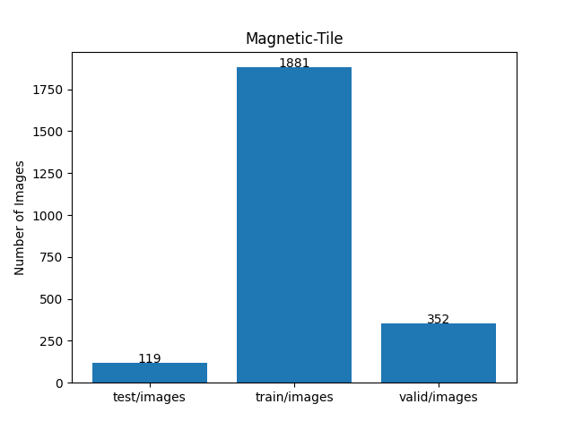 
 
  
<b>Train_images_sample</b> 

 
<b>Train_masks_sample</b> 
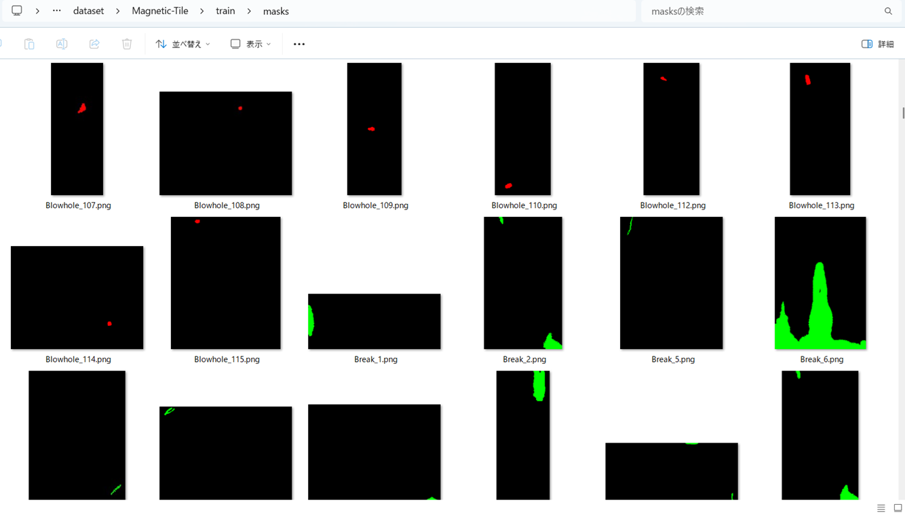
 
<h3>
3 Train TensorflowFlexUNet Model
</h3>
 We trained Magnetic-Tile TensorflowFlexUNet Model by using the following
<a href="./projects/TensorFlowFlexUNet/Magnetic-Tile/train_eval_infer.config"> <b>train_eval_infer.config</b></a> file.  
Please move to ./projects/TensorFlowFlexUNet/Magnetic-Tile and run the following bat file. 
<pre>
>1.train.bat
</pre>
, which simply runs the following command. 
<pre>
>python ../../../src/TensorFlowFlexUNetTrainer.py ./train_eval_infer.config
</pre>

<b>Model parameters</b> 
Defined a small <b>base_filters=16</b> and a large <b>base_kernels=(11,11)</b> for the first Conv Layer of Encoder Block of 
<a href="./src/TensorFlowFlexUNet.py">TensorFlowFlexUNet.py</a> 
and a large num_layers (including a bridge between Encoder and Decoder Blocks).
<pre>
[model]
image_width    = 512
image_height   = 512
image_channels = 3
input_normalize = True
normalization  = False
num_classes    = 6
base_filters   = 16
base_kernels  = (11,11)
num_layers    = 8

dropout_rate   = 0.05
dilation       = (1,1)
</pre>

<b>Learning rate</b> 
Defined a small learning rate.  
<pre>
[model]
learning_rate  = 0.00007
</pre>

<b>Loss and metrics functions</b> 
Specified "categorical_crossentropy" and "dice_coef_multiclass". 
<pre>
[model]
loss           = "categorical_crossentropy"
metrics        = ["dice_coef_multiclass"]
</pre>
<b >Learning rate reducer callback</b> 
Enabled learing_rate_reducer callback, and a small reducer_patience.
<pre> 
[train]
learning_rate_reducer = True
reducer_factor     = 0.4
reducer_patience   = 4
</pre>
<b>Early stopping callback</b> 
Enabled early stopping callback with patience parameter.
<pre>
[train]
patience      = 10
</pre>
<b></b> 
<b>RGB color map</b> 
rgb color map dict for Magnetic-Tile 1+5 classes. 
<pre>
[mask]
mask_file_format = ".png"
;Magnetic-Tile 1+5
rgb_map = {(0,0,0):0, (255, 0, 0):1, (0,255,0):2, (0,0,255):3,(255,255,0):4,(255,0,255):5,}

</pre>
<b>Epoch change inference callbacks</b> 
Enabled epoch_change_infer callback. 
<pre>
[train]
epoch_change_infer       = True
epoch_change_infer_dir   =  "./epoch_change_infer"
epoch_changeinfer        = False
epoch_changeinfer_dir    = "./epoch_changeinfer"
num_infer_images         = 6
</pre>
By using this epoch_change_infer callback, on every epoch_change, the inference procedure can be called
 for 6 images in <b>mini_test</b> folder. This will help you confirm how the predicted mask changes 
 at each epoch during your training process.    
<b>Epoch_change_inference output at starting (1,2,3)</b> 
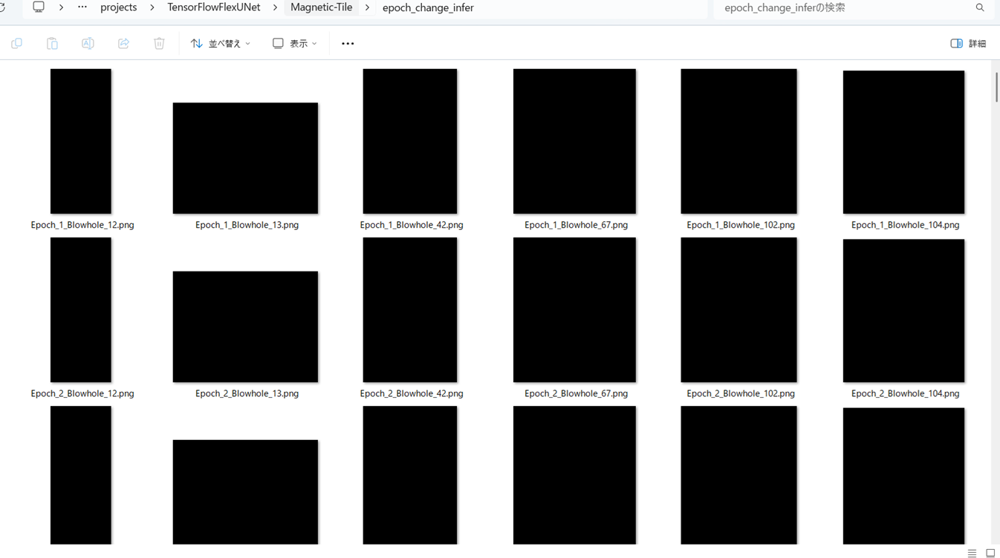 
 
<b>Epoch_change_inference output at ending (17,18,19)</b> 
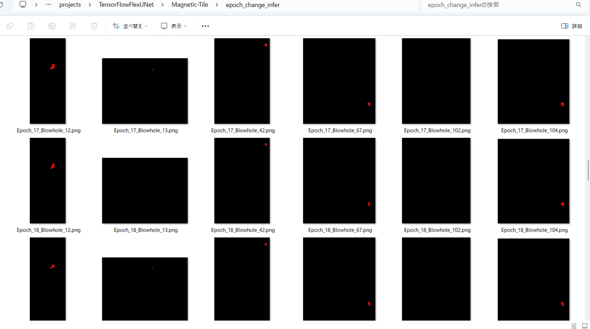 
 
<b>Epoch_change_inference output at ending (35,36,37)</b> 
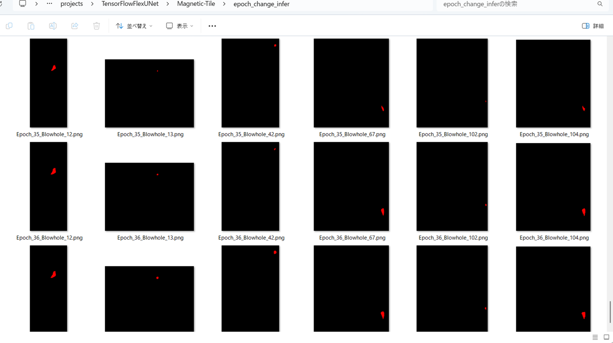 

 
In this experiment, the training process was stopped at epoch 37 by EarlyStoppingCallback.  
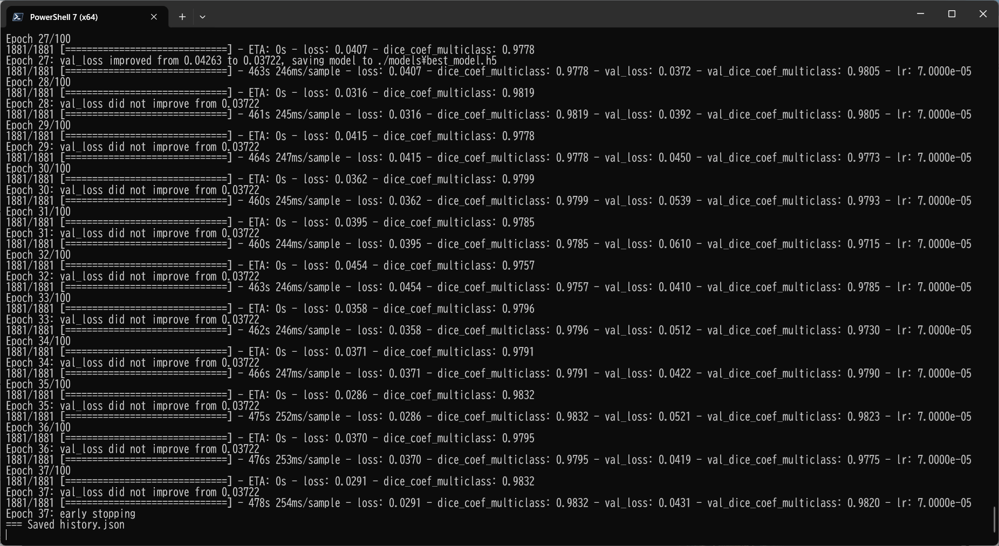 
 
<a href="./projects/TensorFlowFlexUNet/Magnetic-Tile/eval/train_metrics.csv">train_metrics.csv</a> 
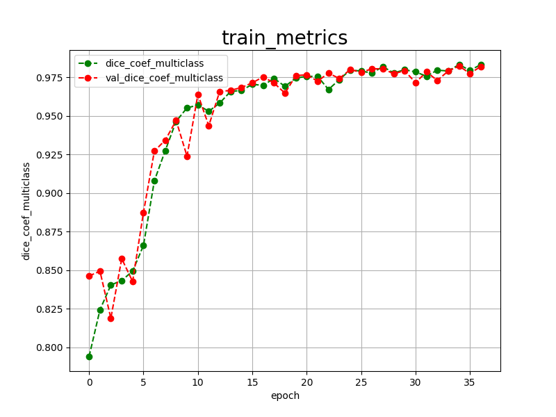 

 
<a href="./projects/TensorFlowFlexUNet/Magnetic-Tile/eval/train_losses.csv">train_losses.csv</a> 
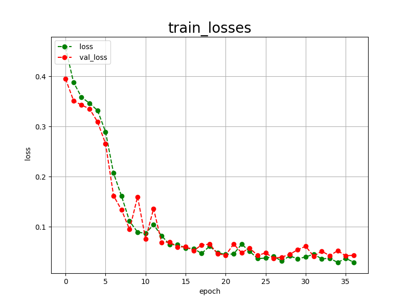 
 
<h3>
4 Evaluation
</h3>
Please move to a <b>./projects/TensorFlowFlexUNet/Magnetic-Tile</b> folder, 
and run the following bat file to evaluate TensorflowFlexUNet model for Magnetic-Tile. 
<pre>
>./2.evaluate.bat
</pre>
This bat file simply runs the following command.
<pre>
>python ../../../src/TensorFlowFlexUNetEvaluator.py  ./train_eval_infer.config
</pre>
Evaluation console output: 
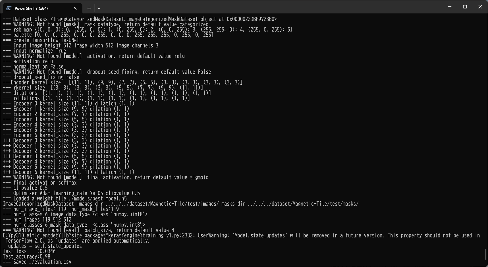
  Image-Segmentation-Magnetic-Tile

<a href="./projects/TensorFlowFlexUNet/Magnetic-Tile/evaluation.csv">evaluation.csv</a> 
The loss (categorical_crossentropy) to this Magnetic-Tile/test was not low, but dice_coef_multiclass high as shown below.
 
<pre>
categorical_crossentropy,0.0346
dice_coef_multiclass,0.98
</pre>
 
<h3>5 Inference</h3>
Please move to a <b>./projects/TensorFlowFlexUNet/Magnetic-Tile</b> folder 
,and run the following bat file to infer segmentation regions for images by the Trained-TensorflowFlexUNet model for Magnetic-Tile. 
<pre>
>./3.infer.bat
</pre>
This simply runs the following command.
<pre>
>python ../../../src/TensorFlowFlexUNetInferencer.py ./train_eval_infer.config
</pre>

<b>mini_test_images</b> 
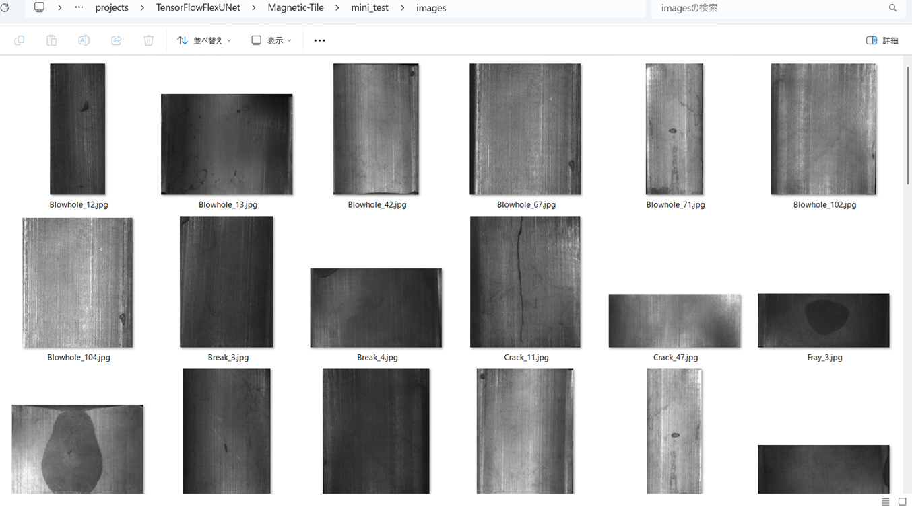 
<b>mini_test_mask(ground_truth)</b> 
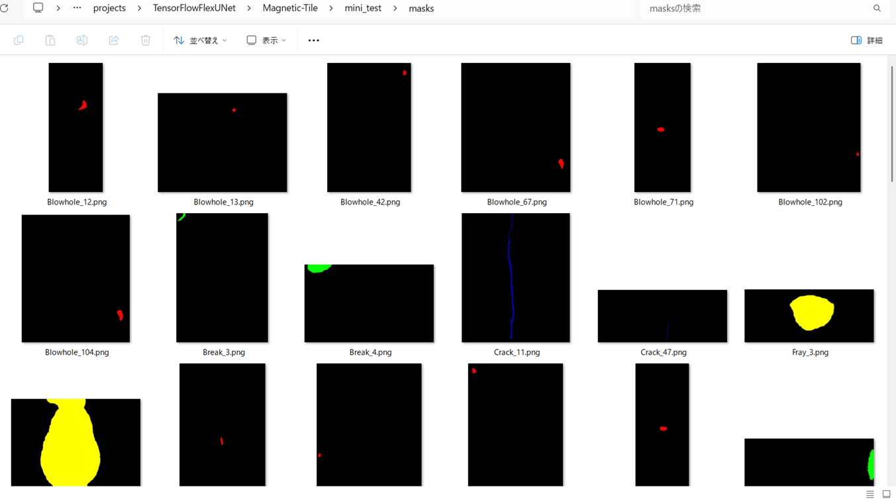 

<b>Inferred test masks</b> 
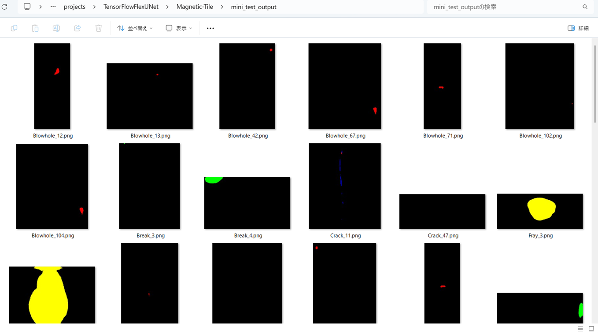 
 

<b>Enlarged images and masks for  Steel-Rail-Surface-Defect Images </b> 
As shown below, the inferred masks predicted by our segmentation model trained by the dataset appear similar to the ground truth masks.
 
<b>rgb_map = {Blowhole:red, Break:green, Crack:blue, Fray:yellow,  Uneven:mazenda}</b> 
 
<table border=1 style='border-collapse:collapse;' cellpadding='5'>
<tr>
<th>Input: image</th>
<th>Mask (ground_truth)</th>
<th>Prediction: inferred_mask</th>
</tr>
<tr>
<td></td>
<td></td>
<td></td>
</tr>

<tr>
<td></td>
<td></td>
<td></td>
</tr>

<tr>
<td></td>
<td>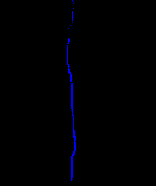</td>
<td>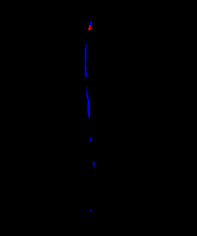</td>
</tr>
<tr>
<td></td>
<td></td>
<td></td>
</tr>
<tr>
<td>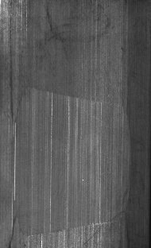</td>
<td>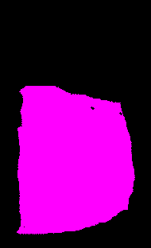</td>
<td></td>
</tr>
<tr>
<td>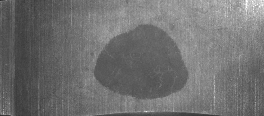</td>
<td></td>
<td></td>
</tr>
</table>

 
<h3>
References
</h3>
<b>1. Segmentation_Method_of_Magnetic_Tile_Surface_Defects_Based_on_Deep_Learning</b> 
Y. An, Y.N. Lu, T.R. Wu 
<a href="https://www.researchgate.net/publication/359331481_Segmentation_Method_of_Magnetic_Tile_Surface_Defects_Based_on_Deep_Learning">
https://www.researchgate.net/publication/359331481_Segmentation_Method_of_Magnetic_Tile_Surface_Defects_Based_on_Deep_Learning</a>
 
 
<b>2. A novel dual-student reverse knowledge distillation method for magnetic tile defect detection</b> 
Jiyan Tang, Ao Zhang & Weian Liu  
<a href="https://www.nature.com/articles/s41598-025-12339-2">
https://www.nature.com/articles/s41598-025-12339-2
</a>
 
 
<b>3. Surface Defect Detection of Magnetic Tiles Based on YOLOv8-AHF</b> 
Cheng Ma, Yurong Pan andJunfu Chen 
<a href="https://www.mdpi.com/2079-9292/14/14/2857">
https://www.mdpi.com/2079-9292/14/14/2857
</a>
 
 
<b>4. TensorFlow-FlexUNet-Image-Segmentation-Model</b> 
Toshiyuki Arai  
<a href="https://github.com/sarah-antillia/TensorFlow-FlexUNet-Image-Segmentation-Model">
https://github.com/sarah-antillia/TensorFlow-FlexUNet-Image-Segmentation-Model
</a>
 
 
